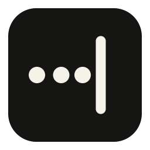

<p align="center">
  
</p>

<h1 align="center">SAID</h1>

<p align="center">
  <strong>Say it once.</strong><br>
  Local voice. Exact text. Your words land at the caret—on this PC.
</p>

<p align="center">
  
  
  
  <a href="LICENSE"></a>
</p>

<p align="center">
  <a href="https://github.com/supdub/said/releases"></a>
</p>

> [!WARNING]
> The `v0.2.0` installer and portable build are not Authenticode-signed, so
> Microsoft Defender SmartScreen may show an **unrecognized app** warning.
> Download SAID only from this repository's release page and verify the files
> against the attached `SHA256SUMS.txt` before running them.

SAID is a lightweight Windows 10/11 voice keyboard. Tap your shortcut once,
speak in Chinese, English, or both, and tap it again. Your words land at the
caret without leaving this PC.

Right Alt is the default shortcut; F8 is available for AltGr keyboard layouts. Recognition runs locally with the multilingual SenseVoice Small model through `sherpa-onnx`. A separate Chinese/English punctuation pass improves readability without rewriting embedded English, and Chinese output is normalized to simplified characters. SAID does not summarize, translate, remove filler words, change tone, or send audio to a cloud service.

## User experience

1. Put the caret in any editable field.
2. Tap your SAID shortcut. A compact status instrument appears without taking focus.
3. Speak naturally. The waveform follows the live microphone level.
4. Tap the shortcut again. The dots resolve into a caret while SAID turns speech into text, then the text is inserted at the original caret.

On first launch, SAID runs a short microphone check, lets you choose **Right Alt** or **F8**, and lets you rehearse the shortcut. Double-click the SAID tray icon at any time to reopen **Setup & settings**.

If focus changes before recognition finishes, SAID copies the transcript instead of typing into the wrong app. The microphone is open only between the two shortcut presses. The model stays loaded so later dictations begin quickly.

## Install on Windows

Run `SAID-Setup-0.2.0.exe`. The per-user installer does not need administrator access. It installs SAID and its local speech model, adds Start Menu and uninstall entries, optionally creates a desktop shortcut, and can keep SAID ready after sign-in.

The portable `SAID-windows-x64-0.2.0.zip` is available for users who do not want an installed app.

## Build on Windows

Prerequisites: Visual Studio 2022 Build Tools with Desktop C++, CMake 3.21+, Git, PowerShell 5+, and NSIS for the installer.

```powershell
Set-ExecutionPolicy -Scope Process Bypass
./scripts/build-windows.ps1
```

The script builds `said.exe`, runs tests, downloads and verifies the pinned speech, token, punctuation, and voice-activity models, creates the portable ZIP, and builds the monochrome NSIS installer. The first build downloads about 315 MB of model data and caches it under the build directory. Pass `-SkipInstaller` only when NSIS is unavailable.

Run the unpacked app with:

```powershell
./dist/SAID/said.exe
```

SAID is a tray app. Right-click its tray icon for status, Setup & settings, the model folder, or Quit SAID. It does not require administrator privileges; Windows prevents normal apps from injecting text into elevated windows.

## Manual CMake build

```powershell
cmake -S . -B build -A x64 -DCMAKE_BUILD_TYPE=Release
cmake --build build --config Release --parallel
```

For an offline source build with an existing `sherpa-onnx` checkout:

```powershell
cmake -S . -B build -A x64 `
  -DSAID_SHERPA_ONNX_SOURCE_DIR=C:/src/sherpa-onnx
```

The model is searched in this order:

1. `--model C:\path\to\sense-voice-small.int8.onnx`
2. `%SAID_MODEL%`
3. The legacy `%VOICEKEY_MODEL%` override for transition installs
4. `models\sense-voice-small.int8.onnx` beside `said.exe`
5. `%LOCALAPPDATA%\SAID\models\sense-voice-small.int8.onnx`
6. Legacy local and installed model folders

The selected model directory must also contain `sense-voice-small.tokens.txt`, `ct-transformer-punctuation.int8.onnx`, and `silero-vad.onnx`. SAID rejects partial bundles at startup instead of failing during dictation.

The Visual Studio build remains the supported release build. Public artifacts should be Authenticode-signed; unsigned local builds can trigger Microsoft Defender SmartScreen reputation warnings.

## Existing installations

The transition release reads current SAID settings first and then falls back to the pre-rebrand registry key, model environment override, and model folders. It replaces the old startup entry with `SAID`, and the compatible single-instance guard prevents the old and new executables from running together. Old Whisper `.bin` files are not compatible with the new recognizer and are left untouched. The uninstaller deliberately leaves user model files in `%LOCALAPPDATA%\SAID\models`.

## Hardware requirements and benchmark

SAID runs recognition entirely on the CPU; it does not require a dedicated GPU
or NPU. These recommendations include enough headroom to keep an editor, browser,
and normal development tools open while dictating.

| | Practical minimum | Recommended for coding |
| --- | --- | --- |
| Operating system | Windows 10 or 11, 64-bit | Windows 11, 64-bit |
| Processor | 4-core x64 CPU | 6 or more modern CPU cores / 12 or more logical processors |
| Memory | 8 GB RAM | 16 GB RAM; 32 GB for containers, virtual machines, or large local builds |
| Storage | SSD with 1 GB free during setup | SSD with 1 GB for SAID plus room for the development toolchain |
| Graphics | Integrated graphics are sufficient | No dedicated GPU is needed |

The installed app and models occupy 323 MB. Once loaded, the reference run used
about 564 MB of memory while idle and reached a 605 MB high-water mark during
startup. The microphone and inference CPU work are inactive between dictations.

### Reference performance

The current Release x64 build was measured on an Intel Core i9-14900HX with 32
logical processors available to the benchmark, 16 GB RAM, and SSD storage. Each
result is the median of three new-process runs against the same 30.42-second
bilingual recording; the model and file data were already in the operating-system
cache.

| Recognition threads | Model load | Recognition | Speed vs. recording | Peak memory |
| ---: | ---: | ---: | ---: | ---: |
| 1 | 1.34 s | 2.18 s | 14x real time | 601 MB |
| 2 | 1.24 s | 1.29 s | 24x real time | 602 MB |
| 4 | 1.26 s | 0.86 s | 35x real time | 609 MB |
| 8 (automatic on this CPU) | 1.29 s | 0.95 s | 32x real time | 610 MB |

For shorter samples, 5.59 seconds of Mandarin took 0.17 seconds and 7.15 seconds
of English took 0.19 seconds after model loading. SAID keeps the model loaded, so
the model-load cost normally occurs once when the app starts rather than after
every dictation.

The automated development environment cannot provide native Windows timing, so
these results are directional measurements of the Windows x64 executable under
a compatibility layer, not a hardware certification. The practical minimum is
deliberately conservative; native Windows results may vary with CPU generation,
power mode, microphone driver, and other work running at the same time.

### Runtime profile

- Native Win32 UI and global keyboard hook; no Electron or browser runtime.
- The CPU-only SenseVoice, punctuation, and VAD models remain loaded after startup.
- SenseVoice uses non-autoregressive decoding with automatic language selection for Mandarin/English code switching.
- Dictations up to 25 seconds are recognized intact. Longer audio is split at speech boundaries into segments no longer than 20 seconds.
- Inference uses up to half the logical processors, capped at eight threads.
- Audio capture is capped at ten minutes per dictation.

## Current limitations

- Some elevated or unusually sandboxed applications can reject Windows Unicode input; SAID copies the transcript in that case.
- Users with AltGr keyboard layouts should select F8 during setup so Right Alt does not intercept AltGr characters.
- Very short English insertions inside Mandarin—especially uncommon names and one-syllable words—remain the hardest recognition case.

See [Mixed Chinese/English ASR investigation](docs/MIXED_LANGUAGE_ASR.md) for the benchmark and design rationale.
